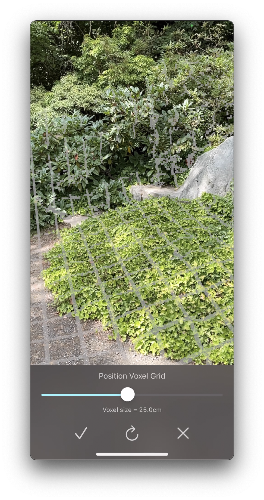
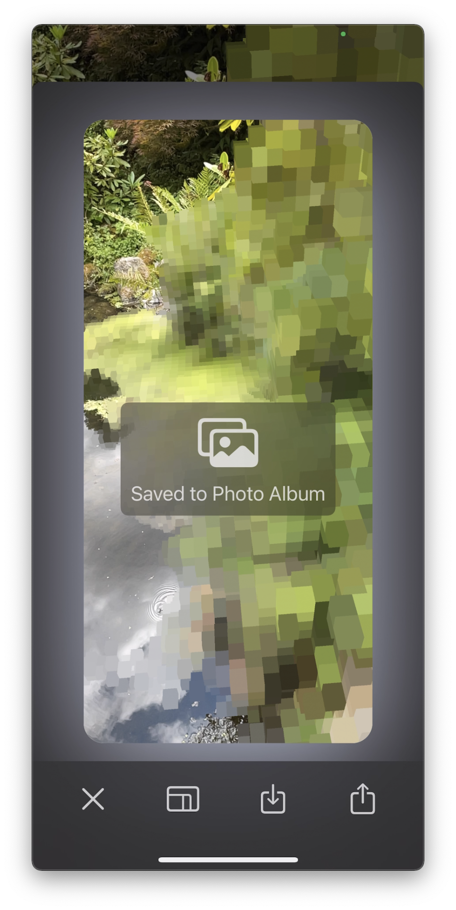

# voxelizeAR

[voxelizeAR][app] is a novel augmented reality app for iPhone and iPad that lets you turn the real world into [voxels](https://en.wikipedia.org/wiki/Voxel).

This documentation covers the basics of using voxelizeAR. If you run into any issues or have any feature requests, you can also [file an issue][issues] here.

## Placing voxel grid

To get start, place the 3D grid that the voxels will fit into.

For devices with a LiDAR sensor — such as the iPhone 12 Pro or iPad pro — you can voxelize arbitrary 3D geometry in the world around you. In placement mode, the grid is overlaid on all real world surfaces within 4 meters of so of the device's camera. This 3D voxel grid is shown in the image above.

Devices without a LiDAR sensor are limited to voxelizing flat horizontal or vertical surfaces. In placement mode, the grid will be drawn on all detected flat surfaces. This is shown in the above image. You can only voxelize these detected surfaces. Try moving your device about the have it detect additional surfaces. Surface detection works best with good lighting on matte surfaces with some texture.

> 🎵 **Note**: Drag to rotate the voxel grid. This lets you line up the voxel grid with real world objects.

During placement, you can also adjust the size of the voxels using the voxel size slider. Smaller voxels capture more detail, while larger ones offer more chunky visuals.

You can always return to placement mode to see which surfaces can be voxelized. However if you with to rotate the voxel grid or change voxel sizes, you must reset the grid, which clears all existing voxels.

## Voxelization

After placing the voxel grid, touch the screen to voxelize that part of the world. If you are touching the screen and nothing appears to be happening, try:

- If you are using a device with a LiDAR sensor, make sure you are touching a solid surface within 4 meters or so of your device. The 3D depth detection also struggles with transparent and reflective surfaces. This means that you cannot typically voxelize glass or water.

    You can also switch back to the grid view to see which surfaces can be voxelized. All valid surfaces will have the grid overlay drawn on them.

- If you are using a device without a LiDAR sensor, make sure you are touching somewhere on a flat horizontal or vertical surface. You can also switch back to grid mode to see which surfaces have been detected.

    Also keep in mind that surface detection is not instantaneous, so if it may take a few seconds because you can start drawing on a surface. Try moving your device around to aid with surface detection.

By default, touching the screen will only voxelize the point where you are touching. Tap on the brush icon to adjust the radius of the voxelization tool.

In the tool panel, you can also switch the erase mode. This will remove existing voxels anywhere you touch.

## Sharing

Tap the camera button on the right side to capture a screenshot of the current scene. This screenshot hides all UI elements so that you only see scene.

Tap the video button to start recording a video. This will show a prompt asking if you'd also like to record your microphone input. Tap the video button again to stop recording.

After taking a video or screenshot, you can download it to your photos or share it using the standard iOS share sheet. You can also trim videos right in the app.

## Feedback

Love voxelizeAR? Be sure to tell your friends about it and share any cool content you create using the app. If you are feeling especially generous, please also write an App Store review. This really helps other people find the app.

Run into a bug or want to request a new feature? Just [file an issue][issues]!

[app]: https://apps.apple.com/us/app/voxelizear/id1575681728
[issues]: https://github.com/mattbierner/voxelizeAR-support/issues
